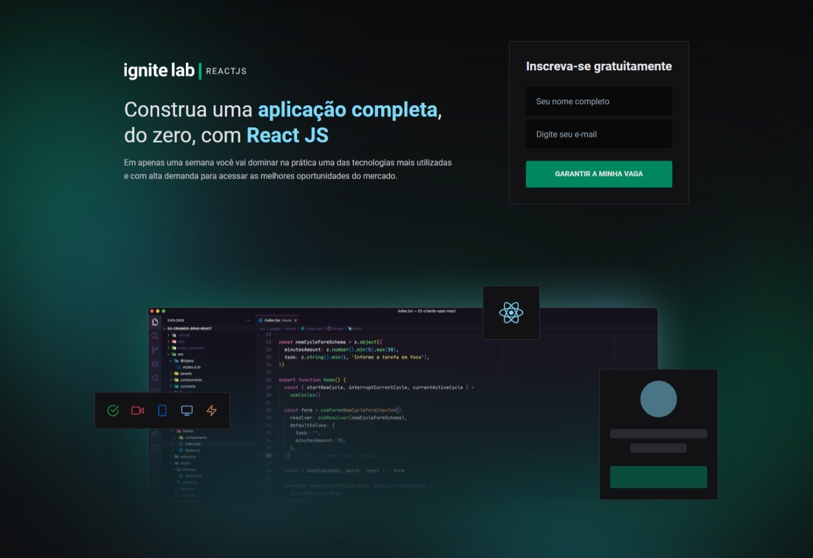
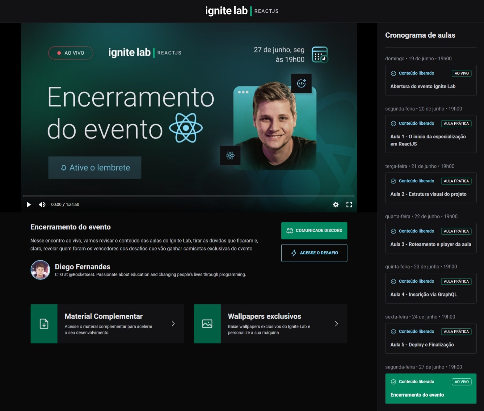

<h1 align="center">💻 Event Platform</h1>

  <strong>Aplicação realizada no Ignite Lab | REACTJS da Rocketseat.</strong>

  

  

### Site 💻

- [Event Platform](https://event-platform-matheusdias20.vercel.app)

## Linguagens e Tecnologias: 🚀
- REACTJS
- Tailwind CSS
- GraphQL
- Phosphor Icons

## Referências: ⌨️

- [Figma](https://www.figma.com/community/file/1120711251998877938)
